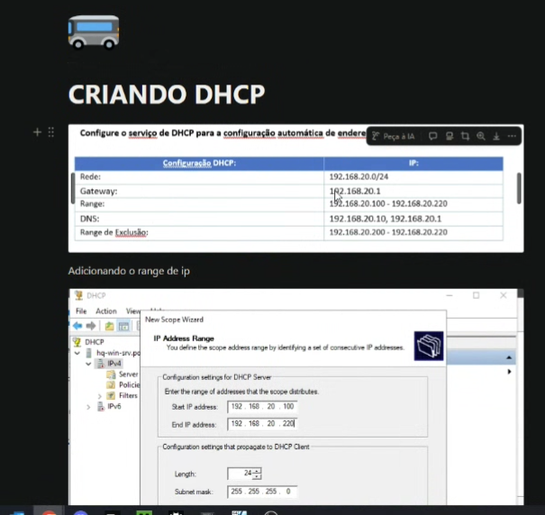

# Aula 1- gustavo

---

vai cair na prova ☝️☝️☝️

Fazer o processo que ele mandou no grupo

e configurar a maquina(video ele vai postar no drive)

nao instalar 👆

criar dhcp na maquina(ver no video)  caso de um b.o pode voltar a snapshot pra conseguir ir testando